## Práctica 2: Unity Perforce
## Objetivo: experimentar el control de versiones con Perforce.

1. Utilizar la herramienta HellixCore con el repositorio creado para el proyecto de la tarea 1
2. Documentar el proceso en el fichero Readme.md del proyecto creado en la tarea 
3. Modificar el fichero presentacion.txt, agregando una frase que indique tu nombre y resuma tu experiencia en el programación de videojuegos 2D y 3D.
4. Crear un fichero nuevo, tu_nombre.txt y añádelo al proyecto.
5. Crear un proyecto Unity 3D básico y agregarlo al depot de la asignatura. Tu nombre debe ser prefijo.

## Desarrollo
Para la realización de esta practica se ha realizado lo siguiente:
 - Utilizar la herramienta HellixCore  con el repositorio creado para el proyecto de la tarea 1.
    - El primer paso es crear un Workspace, o un directorio local en nuestro PC que contendrá copias locales de ficheros almacenados en el servidor de
    Perforce y con el que deberemos sincronizarnos.Para ello, lo primero es abrir el desplegable de Workspaces y seleccionar la opción de añadir uno nuevo. 
    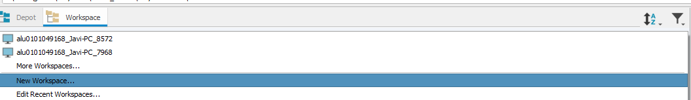
    - Esto nos abrirá una nueva ventana, en la cual deberemos especificar el nombre del Workspace, en qué directorio local lo almacenaremos y con qué 
    depots queremos sincronizarlo. En nuestro caso solo necesitamos el llamado FDV2223, por lo que eliminaremos todos los demás para que no se sincronicen 
    con nuestro Workspace. Al terminar pulsamos Ok.
    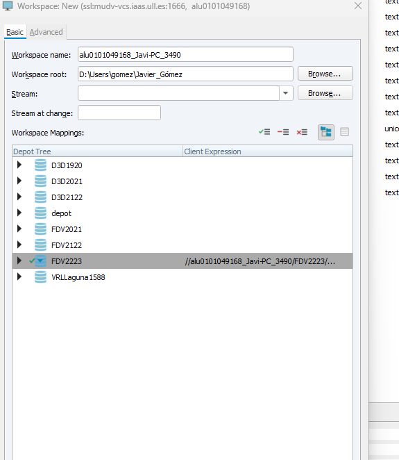
    - Debemos tener cuidado al selecionar la ruta del depot, ya que contenia la ruta de "/FDV2223/..."(se elimina).
    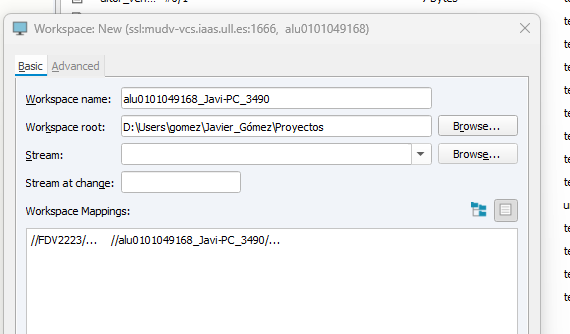
    - Si el directorio que hemos especificado no existía previamente, veremos que nos lo ha creado.
    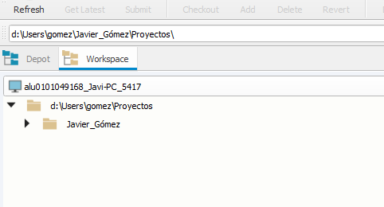
    - Dentro del WorkSpace tendremos nuestro proyecto de la entrega 1 el cual subiremos al depot asignado en este caso FDV2223.
    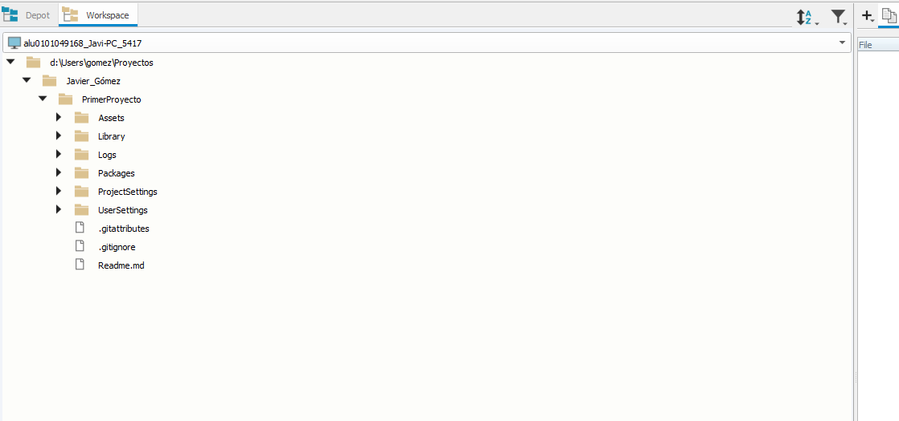
 - Modificar el fichero presentacion.txt, agregando una frase que indique tu nombre y resuma tu experiencia en el programación de videojuegos 2D y 3D.  
    - Pero antes de subir el proyecto se nos ha solicitado modificar el archivo presentación.txt
    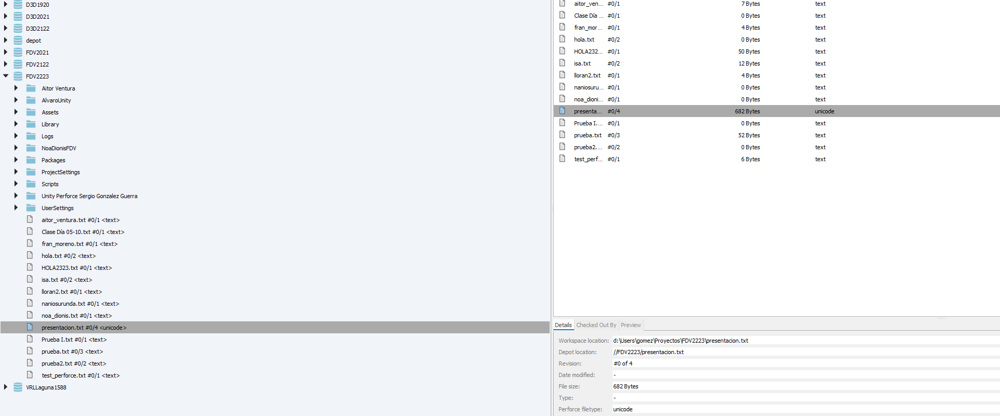
    - Para ello llevamos a cabo un CHECKOUT, ya que todos los ficheros en el Workspace son de sólo lectura. La primera acción que hay que llevar a cabo es desbloquearlo para que no sea de sólo lectura y advertir al resto del equipo. Esto lo hacemos marcando con CHECKOUT. Por tanto, cuando vamos a trabajar sobre   el fichero lo marcamos en P4V y automáticamente el servidor comunica al resto de clientes el estado actual del fichero.
    - Al hacer click derecho sobre el archivo se abrirá una pestaña preguntando a qué Changelist queremos asociar los datos de este fichero. Elegiremos una nueva o default y en la pestaña Pending, donde aparecen todas las Changelists, aparecerá el fichero que acabamos de desbloquear, pero esta vez su icono tendrá un símbolo de check de color rojo en la esquina superior izquierda, lo que significa que lo hemos reservado para poder modificarlo y ya ha dejado de ser read-only. 
    - Al hacer click derecho sobre el archivo se abrirán varias opciones y elegimos "Edit Pending Changelist"
    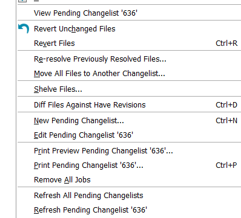
    - Se nos abrirá una pestaña como esta: (esta imagen es de ejemplo no se corresponde al archivo mencionado). 
    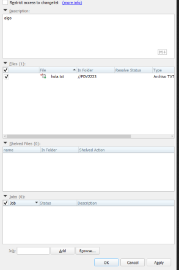
    - Seleccionamos el archivo y se abrirá con el bloc de notas. Desde ahí podremos modificarlo. 
    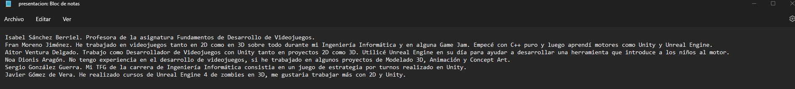
    - Finalmente vamos a la pestaña de Pending, seleccionar la Changelist que queremos sincronizar con el servidor. Ponemos una descripción para la Changelist y pulsar en Submit. Tras esto, nuestros cambios ya estarán en el servidor.
  - Crear un fichero nuevo, tu_nombre.txt y añádelo al proyecto.  
    - Ahora queremos añadir un archivo txt con nuestro nombre al proyecto, para ello creamos un fichero en el directorio en el que se encuentra nuestro Workspace.
    - Una vez hecho esto, seleccionamos la carpeta que queremos subir al Perforce, para ello le daremos al boton Add se nos abrirá una ventana pidiendo que seleccionemos a qué Changelist queremos asociar la modificación. En la imagen vemos que presentacion.txt tiene un símbolo de suma rojo en la esquina superior izquierda. Eso significa que está listo para ser añadido al servidor publicando la Changelist a la cual está asociado (en este caso me confundi y entendi que habia que añadirlo en el proyecto, luego reverti el fichero y el resto de proyecto se quedó subido). Seleccionamos la Changelist y pulsamos en Submit. Escribimos una descripción para la Changelist y pulsamos en Submit. Tras esto, nuestro proyecto ya estará en el servidor. 
    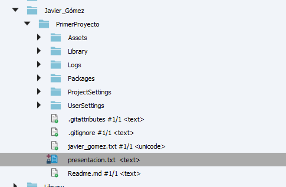
  - Crear un proyecto Unity 3D básico y agregarlo al depot de la asignatura. Tu nombre debe ser prefijo.  
    - Finalmente se nos pide crear otro proyecto básico en Unity y agregarlo al depot. Para ello repetimos los pasos comentdos y seleccionamos en este caso este "proyecto básico" para añadirlo al depot. En la siguiente imagen se puede ver el proyecto en proceso de subida.
    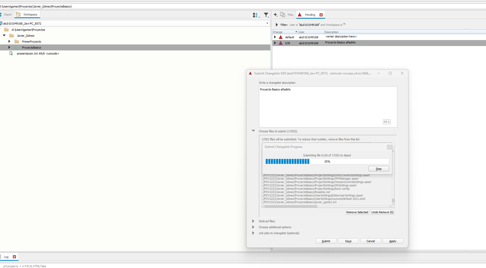
   
